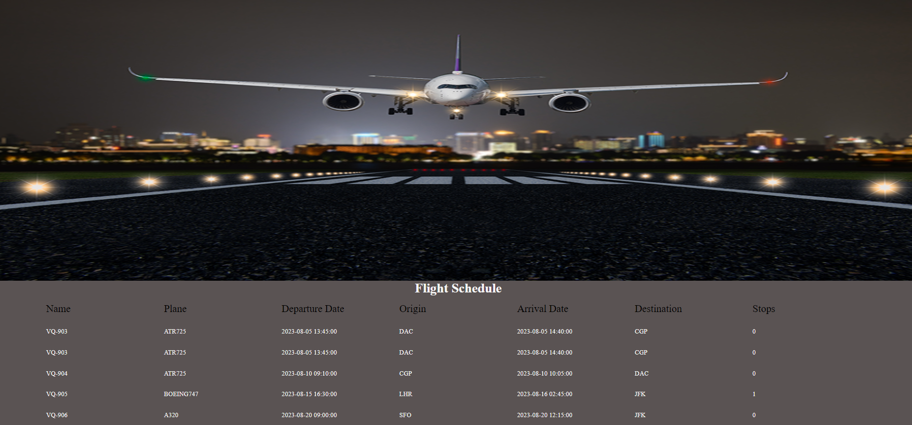

# Flight Schedule

> A simple

## Table of contents

- [Flight Schedule](#flight-schedule)
  - [Table of contents](#table-of-contents)
  - [General info](#general-info)
  - [Screenshots](#screenshots)
  - [Technologies](#technologies)
  - [Setup](#setup)
  - [Code Examples](#code-examples)
  - [Features](#features)
  - [Status](#status)

## General info

> The objective of the project is to practice separation of concern in
> JavaScript.

## Screenshots



## Technologies

- JavaScript
- HTML5
- CSS3
- VSC code

## Setup

clone the repo and start using the stop watch.

## Code Examples

```js
const loadHandler = () => {
	const hadingTitle = createTitle(data.header);
	dom.container.append(hadingTitle);

	const sortedFlight = sortFlight(data.flights);
	sortedFlight.forEach((flightData) => {
		const flightDom = createFlight(flightData);
		dom.container.append(flightDom);
	});
};
```

## Features

List of features ready and Todos for future development

- Hero image
- Title of flight schedule
- List of flight details


## Status

Project is: _in progress_
